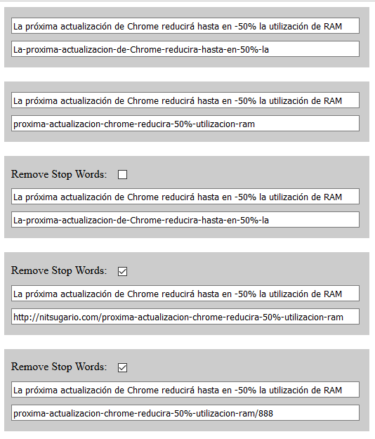

# Friendly URL Jquery
library for making friendly URLs by stripping out  lating chars.

Examples
--------

URLs Amigables

Clase que construye un nombre de URL amigable de acuerdo a los siguientes puntos de SEO:

01.- Usa palabras clave: La inclusión de tus keywords en la url de la página hará que rankeen mejor en Google(los keywords deben estar en el texto de la página, una palabra clave es más relevante cuanto más cerca se sitúe de la TLD o dominio).

02.- Haz la url descriptiva: No hay que incluir las palabras clave con calzador, sino facilitar que la url sea descriptiva de modo que el usuario pueda hacerse una idea del contenido de la página.

03.- No te pases de caracteres y divisiones: Aunque el límite de una URL es de 2048 caracteres es recomendable utilizar direcciones tan cortas y simples como sea posible. 70 es el límite máximo de caracteres para que una url se muestre en el SERP. Cuantas menos palabras tenga la url, mejor. De cuatro a siete palabras es una buena medida a seguir. Entre menos divisiones mejor. Google no indexa el contenido a partir del quinto nivel, y los usuarios se desaniman cuantos más clics tengan que hacer para llegar al contenido que están buscando.

04.- Una página = una url: Asegúrate de que cada página de tu web tiene una url única. Si hay dos o más urls apuntando a la misma página tendrás contenido duplicado a ojos de los motores de búsqueda.

05.- Evita las stop words: Las “stop words” son términos que los buscadores no tienen en cuenta a la hora de indexar el contenido de una página, como preposiciones, pronombres, artículos, etc. Son los de, un, el, para y similares que tal vez te estén quitando caracteres que podrías usar para meter alguna keyword importante.

06.-Las palabras clave, mejor al principio: Poner las palabras más importantes en el inicio de la URL cuanto más cerca se sitúe de la TLD o dominio mejor, los motores de búsqueda no dan mucha importancia a las palabras hacia el final de una URL larga.

07.-No te repitas: No pongas la misma palabra más de dos veces en una url si puedes evitarlo. Puede ser entendido como un intento de sobre optimización.

08.-No mayúsculas: Ya sabes que el uso de mayúsculas suele estar mal visto en internet (suena como gritar), así que evítalo en las urls.

09.-Usa guion alto en vez de guion bajo: Los buscadores no identifican el guion bajo como separador de palabras y en consecuencia cada vez que ven uno introducen un carácter extraño en la url(pues se convierten al enlazar la web en signos como %20).

10.-Utilice subcarpetas en lugar de subdominios: Por lo general es mejor establecer el contenido dentro de una subcarpeta (http://www.dominio.com/subcarpeta) en lugar de un subdominio (http://subdomino.dominio.com). Los motores de búsqueda tratan subdominios como entidades diferentes, y no le pasan rango o autoridad de la misma forma que a una subcarpeta.

11.-No a los caracteres especiales: Evita por todos los medios utilizar caracteres que no formen parte del diccionario en inglés, incuso nuestra “ñ”. Tildes, signos de puntuación, exclamación o interrogación también son poco o nada recomendables, provocan que los navegadores no sepan interpretarlos y muestren un resultado poco vistoso para los usuarios.

12.-Evita los puntos cerca del final de la dirección: Que pueden generar ficheros como .com, .exe… que puedan malinterpretarse por el navegador.

Nota: Cabe aclarar que estos puntos no son necesariamente los únicos, son una recopilación de una investigación que realice en internet y esta es mi conclusión a la que llegue.
